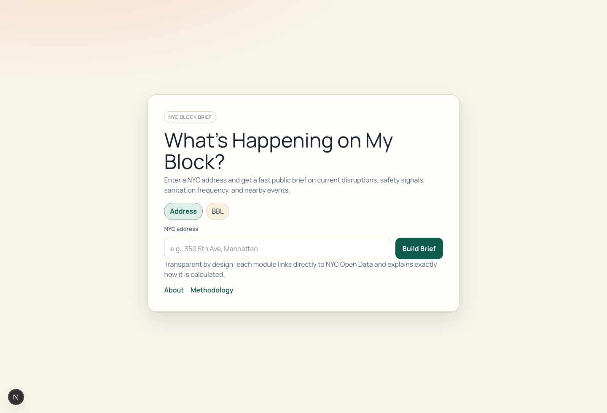

# What's Happening on My Block?

Type one NYC address and get a shareable, plain-English brief of what is actually going on around that block: construction, street closures, collisions, 311 complaints, sanitation, nearby events, and live subway arrivals.

**Live app: https://whats-happening-on-my-block.vercel.app**



## What it does

Give it an address or a BBL and it returns a single mobile-first page that pulls from NYC Open Data and stitches the signals into modules a non-technical neighbor can read:

- Right now: active closures, street works, and film permits
- Construction and DOB permit activity
- Street disruption signals
- Collision safety trends
- 311 complaint pulse with 30-day deltas
- Sanitation pickup frequencies
- Upcoming events and film activity
- Live MTA subway arrivals

Every module carries a plain-English headline, a "what this means for you" line, a Low/Medium/High severity chip with published thresholds, two to four key metrics, expandable detail, source links, and a "how this is calculated" note. The brief is built so a failing data source degrades that one module instead of taking down the page.

## Stack

- Next.js 16 (App Router), React 19, TypeScript
- Leaflet and React Leaflet over OpenStreetMap tiles
- NYC Open Data SODA APIs for civic datasets
- NYC Geoclient v2 geocoding, with NYC GeoSearch as a fallback
- MTA GTFS-realtime for subway arrivals
- Upstash Redis for caching and rate limiting, with an in-memory fallback
- Zod for validation, Pino for logging
- Vitest for unit and integration tests, Playwright for end-to-end

## Quickstart

Requires Node 24 (matches CI). The repo sets `legacy-peer-deps=true` in `.npmrc`, so a plain install works.

```bash
npm install
cp .env.example .env.local   # then set SOCRATA_APP_TOKEN
npm run dev
```

Open http://127.0.0.1:3000.

## Environment variables

Document only. Never commit real values. See `.env.example`.

Required:

- `SOCRATA_APP_TOKEN`: NYC Open Data (Socrata) app token for the SODA APIs
- `NEXT_PUBLIC_APP_URL`: base URL of the app (for example `http://127.0.0.1:3000` in dev)

Optional:

- `GEOCLIENT_APP_ID`, `GEOCLIENT_APP_KEY`: NYC Geoclient v2 credentials. Without them the app falls back to NYC GeoSearch.
- `UPSTASH_REDIS_REST_URL`, `UPSTASH_REDIS_REST_TOKEN`: Upstash Redis for shared cache and rate limiting. Without them the app uses an in-memory cache.
- `MTA_API_KEY`, `MTA_SERVICE_ALERTS_URL`: MTA feed auth and service-alert override for the transit module.

## Routes

Pages:

- `/`: address search
- `/b/{block_id}`: shareable brief
- `/embed/{block_id}`: embeddable widget
- `/about`, `/methodology`

API:

- `GET /api/v2/brief?address=...` or `?bbl=...`
- `GET /api/v2/brief/by-block/{block_id}`
- `GET /api/v2/brief/by-block/{block_id}/311-calls`
- `GET /api/v2/widget/{block_id}`
- `GET /api/v2/geosearch/autocomplete?text=...`
- `GET /api/health`

## Tests

```bash
npm run test        # vitest: unit + integration
npm run test:e2e    # playwright
npm run lint
npm run typecheck
```

CI (`.github/workflows/ci.yml`) runs lint, typecheck, tests, e2e, and build on Node 24. A separate `uptime-check.yml` pings `/api/health`.

## Deploy

Built for Vercel with `main` as the production branch. Point an external uptime monitor at `/api/health`. The brief page has route-level loading and error boundaries, and modules degrade independently.

## Extending it

- Add a data module: `docs/add-module.md`
- Methodology and dataset list: `docs/methodology.md`, `submission/datasets.md`
- Response shape: `BriefResponse` in `src/types/brief.ts`

## Data note

As of February 17, 2026, the sanitation dataset `p7k6-2pm8` returned sparse results over the SODA API on this code path, so the app reads `rv63-53db` as a fallback while keeping `p7k6-2pm8` documented as the preferred source.

## License

MIT. See [LICENSE](LICENSE).
